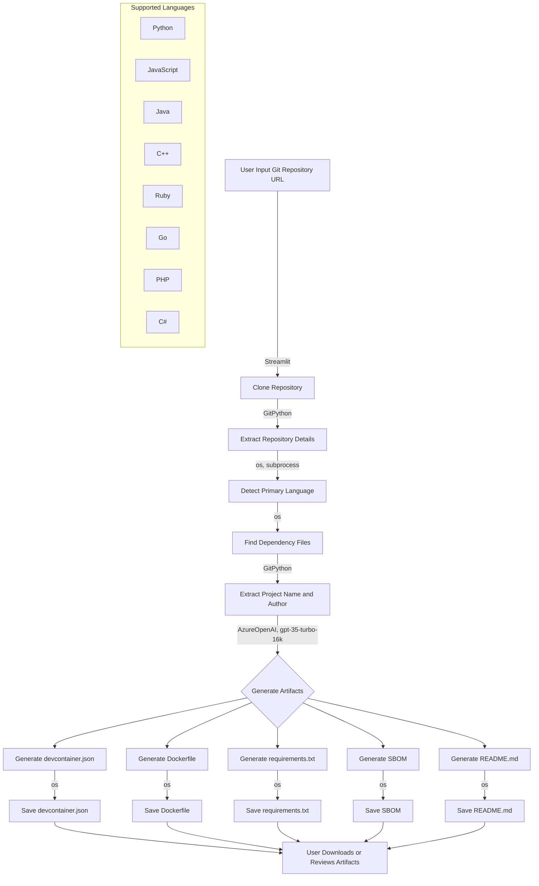

# ⚠️THIS IS THE EXPERIMENTAL BRANCH⚠️
# Automated Generation of Standardized Development Environments

### Overview

This project aims to automate the setup of reproducible development environments for various software projects. By leveraging AI, we can extract relevant information from Git repositories and generate key reproducibility artifacts, ensuring that software runs seamlessly on any computer without manual intervention.

### Objectives

1. **Information Extraction:** 
    - Automatically extract relevant context from a Git repository, including details like programming languages used, dependency requirements, and other specifications.
2. **Artifact Generation:** 
    - Utilize machine learning (ML) to generate required reproducibility artifacts such as `devcontainer.json`, Dockerfiles, requirements files, Software Bill of Materials (SBOM), and README files based on the extracted information.
### Job to be Done

**When** automating the setup of reproducible development environments for various software projects,

**We want to** develop an AI system that can:

1. Extract relevant information from a Git repository and structure it into a standardized format.
2. Generate key reproducibility artifacts from the standardized input using a fine-tuned SLM.

**So that** software development teams can automatically generate comprehensive, reproducible environments that ensure the source code runs seamlessly on any computer.

### Non-Functional Requirements

- **Scalability:**
    - The system should handle large repositories and numerous dependencies.
- **Performance:**
    - Optimize information extraction and artifact generation processes for speed and efficiency.
- **Usability:**
    - Provide a user-friendly interface for inputting Git repository URLs and managing outputs.
- **Reliability:**
    - Ensure high reliability and accuracy in generating the required artifacts.

### Installation
This project requires Python 3.9 or higher.

1. Clone the repository:
    ```bash
    git clone https://github.com/daytonaio-experiments/exp-202408-crimson.git
    cd exp-202408-crimson
    ```
2. Install the required packages:
    1. Using pipenv (recommended):
        ```bash
        pip install pipenv
        pipenv install
        ```
    2. Using pip:
        ```bash
        pip install -r requirements.txt
        ```
    
3. Fill out the .env file:
    ```bash
    cp .env.example .env
    vim .env # Fill in the required values
    ```

4. Run the Streamlit app:
    ```bash
    streamlit run app.py
    ```
5. Open the Streamlit app in your browser (usually at `http://localhost:8501`).

### System Architecture

